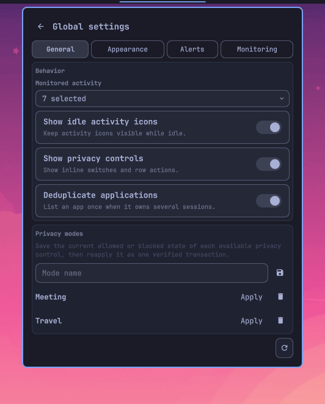
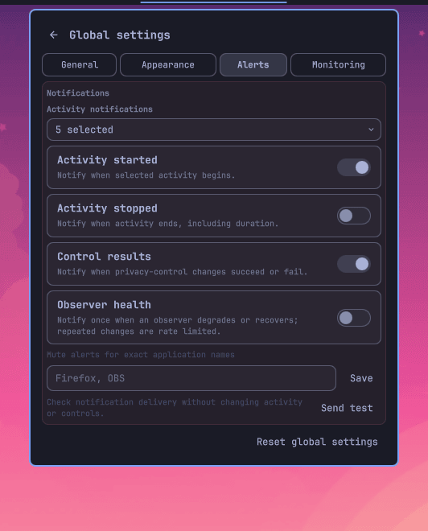
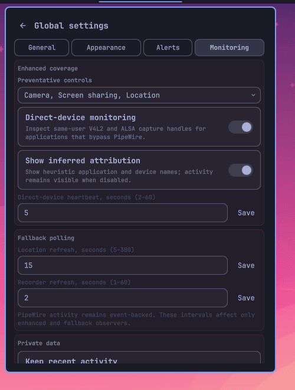
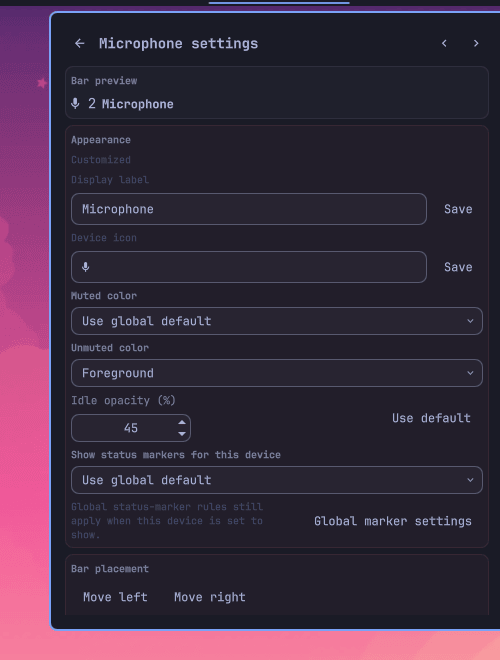

# Privacy Devices

A configurable Omarchy Shell widget that combines privacy activity indicators
and controls for microphones, audio output, cameras, location, screen sharing,
screenshots, and screen recording.

[Website and user guide](https://bolens.github.io/omarchy-privacy-devices/) ·
[Official plugin listing](https://omarchyplugins.com/plugin.html?id=io.github.bolens.privacy-devices) ·
[Documentation](DOCUMENTATION.md) ·
[Get support](SUPPORT.md) ·
[Report an issue](https://github.com/bolens/omarchy-privacy-devices/issues/new/choose)

Contributors: [contributing guide](CONTRIBUTING.md) ·
[architecture](ARCHITECTURE.md) · [security policy](SECURITY.md)


The widget occupies only its privacy-device indicators in the center bar:


<details>
<summary>Settings pages</summary>

| General | Appearance |
| --- | --- |
|  |  |
| Alerts | Monitoring |
|  |  |
| Individual device settings | |
|  | |

</details>

## Highlights

- Per-application activity, session context, controls, and health for seven
  privacy-device classes.
- Reactive PipeWire monitoring plus optional same-user direct-device coverage.
- Verified mute, recording, camera, location, and screen-sharing controls.
- Global and per-device appearance, ordering, visibility, backend, and status
  settings.
- App-aware notifications, private diagnostics, optional bounded history, and
  versioned settings transfer.
- Keyboard navigation throughout the popup and settings.
- Persistent observers and bounded background work, with no network telemetry.

See the [user guide](https://bolens.github.io/omarchy-privacy-devices/#usage)
for supported controls, requirements, configuration, privacy behavior,
troubleshooting, and lifecycle commands.

## Quick install

```sh
omarchy plugin add https://github.com/bolens/omarchy-privacy-devices.git --enable
```

Add or move the widget through **Setup → Bar**, or run:

```sh
omarchy bar move io.github.bolens.privacy-devices --section center
```

## Development

See [CONTRIBUTING.md](CONTRIBUTING.md), the [validation matrix](TESTING.md), and
[ARCHITECTURE.md](ARCHITECTURE.md). Maintainers can refresh interface images
with the restoring [screenshot workflow](TESTING.md#refreshing-screenshots).

## License

[MIT](LICENSE)
