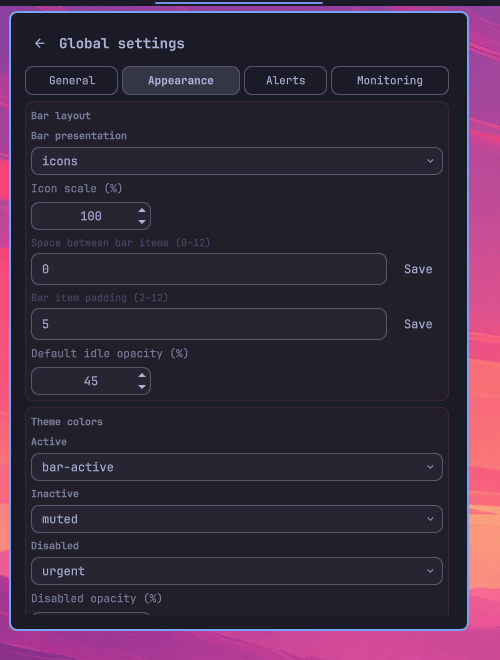

# Privacy Devices

A configurable Omarchy Shell widget that combines privacy activity indicators
and controls for microphones, audio output, cameras, location, screen sharing,
screenshots, and screen recording.

[Website and user guide](https://bolens.github.io/omarchy-privacy-devices/) ·
[Official plugin listing](https://omarchyplugins.com/plugin.html?id=io.github.bolens.privacy-devices) ·
[Get support](SUPPORT.md) ·
[Report an issue](https://github.com/bolens/omarchy-privacy-devices/issues/new/choose)

Maintainers: [architecture](ARCHITECTURE.md) · [testing](TESTING.md) ·
[release playbook](RELEASING.md)


<details>
<summary>Appearance settings</summary>



</details>

## Highlights

- Live per-application privacy activity in the bar and popup.
- Session duration, device, detection source, confidence, and monitoring-health details.
- Optional same-user direct camera and microphone device monitoring for applications that bypass PipeWire.
- Optional bounded local history plus independently reversible display and notification policies.
- Four focused global-settings pages for behavior, appearance, alerts, and monitoring.
- Independent bar icon scale, item spacing, padding, status-marker position, session counts, colors, and idle appearance.
- Live observer freshness, mode, heartbeat, and retry diagnostics on the Monitoring settings page.
- One persistent structured observer replaces per-second screenshot and recorder subprocess polling.
- Private-by-default diagnostic export redacts application and device identities.
- Versioned, bounded settings export/import with private file permissions and atomic replacement.
- Control actions remain pending until a state probe verifies the requested result.
- Keyboard navigation: arrows select activity, Enter opens details, `s` opens settings, `r` rescans, and `1`–`4` switch settings tabs.
- Inline mute, recording, and preventative privacy controls.
- Configurable activity, ordering, icons, visibility, actions, semantic status markers, state pills, popup density, pending animation, session counts, disabled appearance, and
  capture backends.
- Local monitoring with no network telemetry.

See the [user guide](https://bolens.github.io/omarchy-privacy-devices/#usage)
for supported controls, requirements, configuration, privacy behavior,
troubleshooting, and lifecycle commands.

## Quick install

```sh
omarchy plugin add https://github.com/bolens/omarchy-privacy-devices.git --enable
```

Add or move the widget through **Setup → Bar**, or run:

```sh
omarchy bar move io.github.bolens.privacy-devices --section center
```

## Development

```sh
omarchy plugin validate .
qmllint -I "$OMARCHY_PATH/shell" BarWidget.qml Service.qml SettingsSurface.qml IntegerSetting.qml PrivacyActivityCard.qml
shellcheck privacy-control privacy-deps privacy-recording privacy-screenshot
node tests/model.test.js
node tests/controls.test.js
node tests/sessions.test.js
node tests/security.test.js
node tests/settings.test.js
node tests/runtime.test.js
node tests/release.test.js
node tests/site.test.js
python3 -m unittest discover -s tests -p 'test_*.py'
```

See [TESTING.md](TESTING.md) for clean-archive validation, QML runtime checks,
site validation, and live verification.

Enhanced monitoring reads same-user `/proc/<pid>/fd` links for open V4L2 and
ALSA capture devices. It never opens devices or reads media. Recent history is
off by default; when enabled, it stores only session metadata under
`$XDG_STATE_HOME/omarchy-privacy-devices`, limited to seven days or 100 entries.
Disabling or clearing history removes the stored file.

Idle probes are deliberately bounded: direct-device monitoring defaults to a
five-second interval, dependency checks run every five minutes, and control
actions trigger immediate verification instead of waiting for the next poll.

## License

[MIT](LICENSE)
