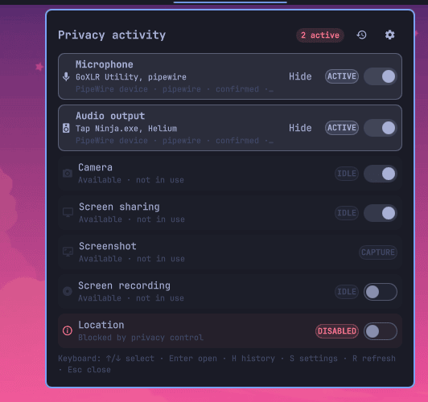

# Privacy Devices

A configurable Omarchy Shell widget that combines privacy activity indicators
and controls for microphones, audio output, cameras, location, screen sharing,
screenshots, and screen recording.



## Features

- Shows live per-application privacy activity in the bar and popup.
- Provides inline mute, recording, and preventative privacy controls.
- Supports per-item ordering, icons, tooltips, visibility, actions, and theme
  colors for inactive, active, muted, and unmuted states.
- Controls audio through `pactl` or `wpctl` while monitoring PipeWire streams.
- Supports Omarchy, GPU Screen Recorder, wf-recorder, and custom recording
  commands.
- Supports Omarchy, Grim, Grim + Satty, Hyprshot, Flameshot, and custom
  screenshot commands.
- Offers modular dependency installation for each control and selected backend.

## Requirements

Omarchy Quattro with Omarchy Shell, Quickshell, Hyprland, and PipeWire. Optional
controls check their own dependencies and show **Install** only when needed:

| Control | Required packages or commands |
| --- | --- |
| Microphone and audio output | `libpulse` (`pactl`) or `wireplumber` (`wpctl`) |
| Camera blocking | `polkit`; custom kernel modules also require `kmod` |
| Location blocking | `geoclue` and `polkit` |
| Screen-share blocking | `xdg-desktop-portal-hyprland` |
| Omarchy screenshots | Omarchy capture command |
| Grim screenshots | `grim` and `slurp` |
| Grim + Satty screenshots | `grim`, `slurp`, `satty`, and `wl-clipboard` |
| Hyprshot screenshots | `hyprshot` |
| Flameshot screenshots | `flameshot`, `grim`, and `xdg-desktop-portal-hyprland` |
| Omarchy or GPU recording | `gpu-screen-recorder` |
| wf-recorder recording | `wf-recorder` and `slurp` |

Custom commands are user-managed and are never installed automatically.
Activity notifications use `notify-send` when available.

## Installation

```sh
omarchy plugin add https://github.com/bolens/omarchy-privacy-devices.git --enable
```

Add or move the widget through **Setup → Bar**, or run:

```sh
omarchy bar move io.github.bolens.privacy-devices --section center
```

## Usage

- Left-click a bar icon to invoke its control or open details for status-only
  items.
- Middle-click a bar icon or popup row to open that item's settings.
- Right-click an icon, or click the combined widget, to open the activity panel.
- Toggle controllable activity rows directly in the popup.

The widget can mute the default microphone and audio output, start or stop
recording, prevent UVC camera access, disable GeoClue location access, and block
the Hyprland screen-sharing portal. Blocking that portal also suspends other
features supplied by it until re-enabled.

## Configuration

Configure the widget through **Setup → Plugins**, or edit its entry in
`~/.config/omarchy/shell.json`. Settings include monitored kinds, display order,
idle visibility and opacity, bar presentation, exclusions, video-classification
keywords, polling intervals, icons, click actions, backend selection, and
per-state color overrides.

Audio control can prefer `pactl`, `wpctl`, or automatic selection. Recording
can follow Omarchy, explicitly use GPU Screen Recorder or wf-recorder, or run
custom start and stop commands. Screenshots can follow Omarchy or use Grim,
Grim + Satty, Hyprshot, Flameshot, or a custom command.

Unrecognized active video-input streams are treated as screen shares by
default. Extend `cameraKeywords` for unusual camera drivers and
`screenShareKeywords` for unusual portal or capture clients.

## Updates

```sh
omarchy plugin update io.github.bolens.privacy-devices
```

## Removal

Re-enable preventative controls you want restored, then run:

```sh
omarchy plugin remove io.github.bolens.privacy-devices
```

Runtime service masks clear on reboot, and UVC cameras normally rebind on
reboot. If a custom camera module remains unloaded, restore it with
`sudo modprobe MODULE_NAME`.

## Privacy and security

The plugin monitors local PipeWire metadata and selected local process state; it
does not send data over the network. UVC camera and GeoClue controls request
Polkit authorization. Camera blocking binds or unbinds USB video interfaces
(with a kernel-module fallback for custom drivers), location blocking applies a
runtime GeoClue mask, and screen-share blocking applies a user-level runtime
portal mask. Runtime masks disappear after reboot.

Custom screenshot and recording commands run unsandboxed as your user. Review
them before saving them.

## Development

```sh
omarchy plugin validate .
qmllint -I "$OMARCHY_PATH/shell" BarWidget.qml Service.qml
shellcheck privacy-control privacy-deps privacy-recording privacy-screenshot
node tests/model.test.js
```

## License

MIT
